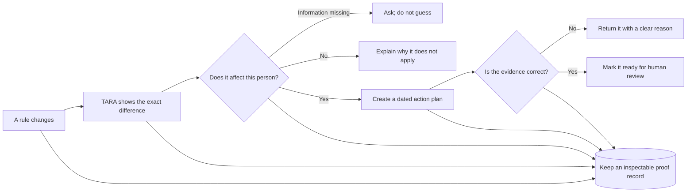

# TARA — Tax, Assets & Residency Advisor

> **Competition prototype:** TARA uses controlled regulatory-source snapshots and synthetic cases to demonstrate a governed regulatory change-to-action workflow. It is not legal, tax, immigration, or filing advice. A qualified professional must review any real-world action.

TARA answers a focused question: **a rule changed—who is affected, what should they do, when, and what evidence would close the work?**



## Start here

| Resource | Use it for |
|---|---|
| [Live demo](https://tara-demo.onrender.com/) | The interactive, deployed prototype. Choose **Maeve** for the tested judge path. |
| [Complete visual guide](https://tara-demo.onrender.com/guide) | One-stop explanation: picture first, technical detail second; source lives at `docs/tara-project-guide.html`. |
| [Evaluation card](docs/evaluation-card.md) | Reproducible acceptance checks and the current evidence-based readiness score. |
| [Competition truth sheet](docs/competition-truth-sheet.md) | Canonical claims, boundaries, and presenter preflight. |
| [Judge-facing slide checklist](docs/judge-slide-checklist.md) | Seven-minute deck structure mapped to the official four judging areas. |
| [Demo runbook](demo/README.md) | Local launch, replay generation, and venue fallback. |

## The tested judge path

The primary demonstration is deliberately narrow and synthetic:

1. Revenue guidance changes the fund-tax rate in **Section 4.3** from **41% to 38%** for deemed disposals arising on or after **1 January 2026**.
2. TARA shows the old wording and the new wording side by side, while keeping digital fingerprints of both sources.
3. It preserves the former and current rule instead of overwriting history.
4. It uses the holding's event date to select 41% before 2026 or 38% from 2026.
5. It creates a clear action plan with dates and the evidence to keep.
6. It rejects a calculation using the old 41% rate and accepts an exact 38% calculation.
7. It verifies the linked proof record for the run.

The browser labels **Maeve** as the recommended path. Ciarán, Priya, and Arun are exploratory breadth cases and must not be described as independently validated legal advice.

## Why this is more than a chatbot

- **Models never own decisive calculations.** Dates, diffs, effective-date selection, threshold checks, arithmetic, and action ordering are deterministic Python.
- **Rules live in data.** Domain packs define sources, obligations, scoping, triggers, obligation-level predicates, and evidence rules.
- **Missing material facts fail closed.** An incomplete threshold or event becomes `indeterminate`; COURSE creates no action.
- **Pack scope is not obligation scope.** COMPASS can confirm that a rule family is relevant while PLOT rules individual duties in, out, or indeterminate.
- **History is inspectable.** Every agent writes to ATLAS, an append-only JSONL chain with linked hashes.
- **The interface is replaceable.** CLI, browser demo, LLM orchestrator, and third-party clients use the same guarded pipeline or MCP tools.

## Current evidence

At the latest verification:

- **112 automated tests pass**.
- **8 executable acceptance checks pass** in `tools/build_evaluation_card.py`.
- **9 domain packs** are loaded: six standalone packs and three declarative cross-border corridors.
- **10 MCP tools** expose the system.
- The browser demo and health endpoint are live on Render.
- Replay output is generated from real API responses for network-safe presentation fallback.

The internal competition-readiness estimate is **87/100**. This is not an organiser or judge score. Points remain deliberately withheld for external user interviews, a design partner, and independent professional validation.

## The nine agents

### Open band — what the rule says

| Agent | Responsibility |
|---|---|
| **SURVEY** | Compare named source snapshots and report provision-level changes with hashes. |
| **LEGEND** | Turn source provisions into discrete, citable obligations. |
| **ALMANAC** | Version the obligation graph and record supersession. |

### Tenant band — what the rule means for one case

| Agent | Responsibility |
|---|---|
| **COMPASS** | Decide whether a pack is in scope: `CONFIRMED`, `EXEMPT`, or `INDETERMINATE`. |
| **PLOT** | Evaluate each obligation's effective date, instrument, event, threshold, trigger, and prior closure. |
| **COURSE** | Convert actionable gaps into owned, dependency-ordered work with before/on/after date semantics. |
| **ANCHOR** | Validate submitted evidence against type, fields, rate, arithmetic, and timing rules. |
| **MERIDIAN** | Run standalone packs and eligible corridor packs against the same holding, then consolidate. |
| **ATLAS** | Preserve the end-to-end, hash-linked decision trace. |

## Domain coverage

The project loads six standalone packs:

1. Irish fund taxation and eight-year deemed disposal (`tax`)
2. Indian foreign-asset and foreign-income disclosure (`india-fa`)
3. US foreign-account and foreign-asset reporting (`us-fbar`)
4. Irish residence-permit registration and renewal (`ireland-irp`)
5. Irish capital-gains tax on property (`ireland-cgt-property`)
6. Indian NRI listed-securities capital gains (`india-nri-securities`)

It also synthesizes three corridor packs from `domains/interactions.yaml`:

- India–Ireland
- India–United States
- Ireland–United States

Coverage is **selected prototype coverage**, not comprehensive compliance clearance.

## Obligation-level safety

A pack-level determination is intentionally coarse. For example, a US tax resident may place the US pack in scope, but that alone must not create FBAR, Form 8938, Form 3520, and Form 8621 actions for every asset.

Each `ObligationSpec` can therefore declare:

- `effective_from` and `effective_to`
- `applies_when` predicates using deterministic operators such as `equals`, `in`, `gt`, and `lte`

PLOT reports one of:

| State | Meaning | Opens an action? |
|---|---|---|
| `satisfied` | Matching evidence already closed this event. | No |
| `partial` | Applicable; event is upcoming. | Yes |
| `absent` | Applicable; evidence is not recorded. | Yes |
| `not_applicable` | A specific condition is false. | No |
| `indeterminate` | A material fact is missing or incompatible. | No |

## Repository map

```text
domains/                         cited rules, scope, triggers, and evidence contracts
data/sources/                     controlled v1/v2 source snapshots
registers/holder_register.json    synthetic test register
tara/core/                        dates, diffs, pack and corridor loaders
tara/agents/                      the nine agents
tara/atlas/                       append-only hash-linked ledger
tara/mcp_server/                  twelve MCP tools over stdio or streamable HTTP
tara/orchestrator/                deterministic and optional LLM clients
tara/pipeline.py                  band-order-enforcing orchestration
demo/                             FastAPI adapter, browser UI, presets, replay
tests/                            unit, integration, safety, and end-to-end tests
tools/build_evaluation_card.py    executable public acceptance report
docs/tara-project-guide.html      canonical visual and technical walkthrough
public-release-manifest.txt       allowlist for clean public publication
```

## Run locally

```bash
python -m venv .venv
source .venv/bin/activate
pip install -e '.[dev]'
pip install -r demo/requirements.txt

pytest -q
python tools/build_evaluation_card.py
python -m uvicorn demo.api:app --host 127.0.0.1 --port 8000
```

Open `http://127.0.0.1:8000`, choose **Maeve**, and follow the source change to the evidence check.

## MCP interface

```bash
python -m tara.cli serve
```

TARA exposes twelve tools:

- `list_domains`
- `list_sources`
- `list_holdings`
- `survey_detect_change`
- `legend_decompose`
- `almanac_refresh`
- `compass_assess`
- `plot_align`
- `course_plan`
- `anchor_verify`
- `meridian_survey`
- `atlas_reconstruct`

A streamable-HTTP server is also available:

```bash
python -m tara.cli serve --transport streamable-http --port 8000
```

The optional LLM orchestrator is an MCP client. It can choose tools and phrase results, but the deterministic pipeline remains responsible for the consequential checks.

With the `llm` extra installed and `OPENAI_API_KEY` configured, run the real OpenAI-over-MCP path:

```bash
pip install -e '.[llm]'
python -m tara.cli orchestrate \
  "Review holding HLD-001 in domain tax on 2026-09-13. The holder answers SQ-03=false. Identify the changed rule and next checks." \
  --model gpt-4.1-mini --show-tool-calls
```

The model discovers exact domain, source, and holding IDs through MCP tools. If a required applicability fact is missing, it stops and asks for that fact rather than guessing. The browser demo remains deterministic and does not require an LLM or network call.

## Demo and replay

The live browser demo first calls its FastAPI adapter. If the host is cold or unreachable, the page uses `demo/replay.js`. Replay mode is labelled and covers only pristine prepared profiles.

Regenerate replay data after changing packs, register fields, agent behavior, or presets:

```bash
python -m uvicorn demo.api:app --port 8000 &
python demo/capture_replay.py
```

## Public release without private history

The private repository remains the working source of truth. The public version is built from an explicit allowlist into a separate directory:

```bash
python tools/build_public_release.py
```

The script:

1. Copies only paths in `public-release-manifest.txt`.
2. Omits `.git`, internal reviews, generated state, caches, local environments, and private working material.
3. Scans the candidate for common secret patterns.
4. Runs the public test and documentation checks.
5. Produces a release manifest with file hashes.

Only after human review should that directory be initialized as a new Git repository and pushed once. That keeps private commits and messages out of the public repository.

## Boundaries and next evidence

TARA does not yet claim:

- continuous source retrieval and approval;
- comprehensive legal coverage;
- independent tax or legal sign-off;
- production authentication, tenancy, encryption, or retention controls;
- regulator acceptance of a submitted artefact; or
- external traction or a signed design partner.

The highest-value next steps are an independent review of the Maeve rule path, five structured interviews with advisers or compliance teams, and one design-partner pilot measured on review time and false-positive reduction.

## Presentation guidance

Lead with the concrete failure: **an internally consistent 41% calculation is wrong for a 2026 event**. Show **What changed**, **What applies**, the **Action plan**, the evidence that **Needs correction**, the evidence that is **Accepted**, and the **Proof record**. Only then explain the nine agents, nine rule packs, and Model Context Protocol integration.

For slide decks, the safest live-demo embed is a button or QR code to [https://tara-demo.onrender.com/](https://tara-demo.onrender.com/), plus two static backup screenshots. Embedded web views are optional and depend on venue networking and presentation software. The [judge-facing slide checklist](docs/judge-slide-checklist.md) maps the story to the official four judging areas.

## License

TARA is released under the [MIT License](LICENSE). The regulatory content and demo outputs remain a bounded prototype and do not constitute legal, tax, immigration, or filing advice.
