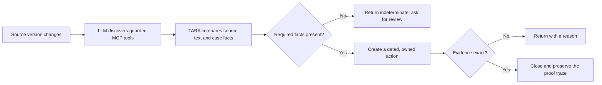

# TARA — Regulatory Change to Action

> **Prototype scope:** TARA uses controlled regulatory-source snapshots and synthetic prepared cases. It is not legal, tax, immigration, or filing advice. A qualified professional must review any real-world action.

TARA is a **regulatory change-to-action prototype**. It turns a versioned source change into a cited, case-specific action and verifies the evidence used to close that action.



## What the prototype demonstrates

The included Maeve scenario uses controlled Revenue guidance in which a Section 4.3 rate changes from **41% to 38%** for relevant events on or after **1 January 2026**. TARA preserves both source versions, selects the applicable version from the event date, creates a dated action, returns a superseded 41% calculation, accepts the exact 38% calculation, and records the process in a hash-linked trace.

The browser uses an LLM as an MCP client. The model discovers the available tools and sequences the investigation. Deterministic Python controls own source comparison, effective-date selection, threshold checks, arithmetic, action ordering, and evidence outcomes. Missing material facts produce `indeterminate`; they do not create an invented action.

## Current implementation

| Capability | Current implementation |
|---|---|
| Domain coverage | Nine domain packs: six standalone packs and three cross-border corridors. |
| Agent contracts | Nine named components across source change, applicability, actions, evidence, cross-border consolidation, and audit. |
| Integration surface | Twelve MCP tools for discovery and controlled execution. |
| Verification | 115 automated tests covering unit, integration, safety, and end-to-end behaviour. |
| Demo data | Synthetic prepared profiles and controlled source snapshots only. |
| Audit trace | ATLAS append-only, hash-linked JSONL records for each run. |

## Run locally

```bash
python -m venv .venv
source .venv/bin/activate
pip install -e '.[dev]'
pip install -r demo/requirements.txt

pytest -q
python -m uvicorn demo.api:app --host 127.0.0.1 --port 8000
```

Open `http://127.0.0.1:8000` to run the browser demo. Set `OPENAI_API_KEY` in the server environment to enable the LLM-first path. Without it, the demo clearly uses its deterministic control path.

## Repository map

```text
domains/                   cited rules, scope, triggers, and evidence contracts
data/sources/              controlled source snapshots
registers/                 synthetic holder register and source registry
tara/                      agents, deterministic pipeline, MCP server, and orchestration
demo/                      FastAPI adapter, browser UI, presets, and replay support
tests/                     unit, integration, safety, and end-to-end coverage
tools/                     developer utilities and clean public-release builder
docs/connecting-ai-clients.md  local MCP client integration guidance
```

## MCP server

Run the local MCP server over stdio:

```bash
python -m tara.cli serve
```

TARA exposes twelve tools: domain, source, and holding discovery; source-change detection; obligation decomposition and versioning; applicability and gap checks; action planning; evidence verification; cross-border consolidation; and trace reconstruction.

For local client configuration, see [Connecting an AI client to TARA's MCP server](docs/connecting-ai-clients.md).

## Operational boundaries

TARA does not claim continuous source retrieval, comprehensive legal coverage, independent professional sign-off, production identity or tenancy controls, durable production storage, or regulator acceptance of an artefact. Do not submit real personal, legal, tax, immigration, financial, or filing data to the public demo.

## License

TARA is released under the [MIT License](LICENSE).
