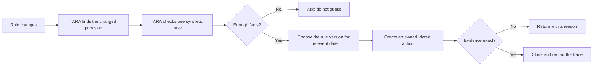

# TARA: From a changed rule to verified evidence

## See the idea first



**TARA is a regulatory change-to-action prototype.** It connects versioned source text to a case-specific action and a checkable proof trail. It is not legal, tax, immigration, or filing advice.

For the complete visual and technical reference, open [tara-project-guide.html](tara-project-guide.html). For the executable results, open [evaluation-card.md](evaluation-card.md).

## The recommended demonstration

Use the synthetic **Maeve** profile at [tara-demo.onrender.com](https://tara-demo.onrender.com/).

1. Revenue's Section 4.3 rate changes from **41% to 38%** for relevant events on or after **1 January 2026**.
2. Maeve's eight-year event falls in 2026.
3. TARA selects the 38% obligation and rules the historical 41% obligation out for this event.
4. COURSE creates the work item and evidence contract.
5. ANCHOR returns the old 41% calculation.
6. ANCHOR closes the exact 38% calculation.
7. ATLAS verifies the linked trace.

> **Why this path matters:** it proves the competition's complete “change to action” loop with one understandable consequence. The other profiles demonstrate breadth and are labelled exploratory.

## The system in plain language

| Agent | Plain-language job |
|---|---|
| SURVEY | Notice exactly what changed in a source. |
| LEGEND | Turn the changed text into small, cited duties. |
| ALMANAC | Keep the rule history and supersession map. |
| COMPASS | Decide whether a rule family is relevant to this case. |
| PLOT | Decide whether each particular duty actually triggers. |
| COURSE | Create the action, owner, date, and requested proof. |
| ANCHOR | Check the proof and return or close it. |
| MERIDIAN | Repeat the same process across countries and corridors. |
| ATLAS | Record every step in a tamper-evident chain. |

## The important safety distinction

A person can be within a **rule family** without triggering every obligation in that family. TARA models that in two stages:

1. COMPASS checks pack-level scope.
2. PLOT checks each obligation's instrument, event, threshold, effective date, trigger date, and prior closure.

PLOT can return `satisfied`, `partial`, `absent`, `not_applicable`, or `indeterminate`. COURSE opens actions only for `partial` or `absent`. A missing material fact never becomes an invented task.

## What is real today

- Nine domain packs: six standalone packs and three cross-border corridors.
- Ten MCP tools.
- A deployed FastAPI/browser demonstration.
- A captured-response replay for venue reliability.
- Deterministic source diffs, date calculations, applicability checks, and evidence validation.
- A hash-linked ATLAS trace.
- 112 passing automated tests.
- Eight executable acceptance checks in `tools/build_evaluation_card.py`.

## What is not claimed

- Continuous source retrieval and approval.
- Comprehensive legal coverage.
- Independent professional sign-off.
- Production identity, tenancy, encryption, or retention controls.
- Regulator acceptance of an artefact.
- External user traction or a signed design partner.

## Technical path

```text
source snapshots
  → SURVEY ChangeRecord
  → LEGEND ObligationRecord
  → ALMANAC version graph
  → COMPASS Determination
  → PLOT GapEntry
  → COURSE Action
  → ANCHOR ClosureResult
  → ATLAS hash-linked entries
```

Domain packs are YAML. Consequential calculations are deterministic Python. The optional LLM layer is an MCP client that can select tools and explain results; it does not own the legal rates, dates, thresholds, or arithmetic.

## Run it

```bash
pip install -e '.[dev]'
pip install -r demo/requirements.txt
pytest -q
python tools/build_evaluation_card.py
python -m uvicorn demo.api:app --host 127.0.0.1 --port 8000
```

## Present it

Lead with Maeve and the wrong-but-consistent 41% calculation. Show the source diff, the effective-date decision, the returned evidence, the accepted evidence, and the ATLAS trace. Only then explain the nine agents, nine packs, and MCP layer.

For a slide deck, use a hyperlink or QR code to [https://tara-demo.onrender.com/](https://tara-demo.onrender.com/) and keep two backup screenshots. Do not rely only on an embedded live web view.
