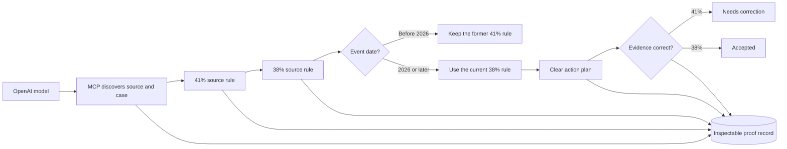

# TARA Competition Truth Sheet

> **Use this page as the source of truth for slides, speaker notes, README claims, and judge answers.** Update it before any public claim.

## Plain-language version

TARA is a **prototype for turning a versioned regulatory-source change into a clear, cited next step for a specific synthetic case**. It shows the source versions, the facts relied on, the applicable rule version, the action, the evidence contract, and the returned audit trace. A qualified professional must review any real-world use.

## Canonical public facts

| Item | Current fact | Public-language rule |
|---|---|---|
| Demo | `https://tara-demo.onrender.com/` | Use as the only live-demo URL and QR target. |
| Health | `https://tara-demo.onrender.com/api/health` | Use for preflight. |
| Complete guide | `https://tara-demo.onrender.com/guide` | Use for judges who want the visual and technical detail. |
| Evaluation | `https://tara-demo.onrender.com/evaluation-card.md` | Use as reproducible supporting evidence. |
| Primary profile | Maeve | Call it the **tested golden path**. |
| Other profiles | Ciarán, Priya, Arun | Call them **exploratory breadth cases**. |
| Source mode | Controlled, versioned snapshots | Do not claim continuous current-law monitoring. |
| Data | Synthetic prepared profiles | Do not enter or request real personal data. |
| AI path | Server-side OpenAI model → local MCP tools → deterministic TARA controls | Say “LLM-first with deterministic control,” not “the model calculates compliance.” |
| AI fallback | Labelled `/api/run` deterministic backup, then labelled replay if the host is unavailable | Demonstrate the main AI path; keep fallback ready. |
| Human role | Required before real action or reliance | Keep visible in the demo and deck. |
| Packs | 6 standalone + 3 corridors = 9 | Selected prototype coverage, not comprehensive clearance. |
| Agents | 9 named agents | Explain the outcome before the architecture. |
| MCP tools | 12 | A discoverable integration surface, not a legal guarantee. |
| Tests | 115 passing at the latest local verification | Re-run `pytest -q` before the pitch. |
| Acceptance checks | 8 passing | Generated by `python tools/build_evaluation_card.py`. |
| Internal score | 87/100 | Evidence-based readiness estimate, not an organiser score. |

## The approved stage claim

> “TARA's OpenAI coordinator discovers the relevant source and case through MCP. TARA then detects a controlled change in Revenue's Section 4.3 rate, selects the 38% rule for a synthetic 2026 event, turns it into an owned action, returns evidence calculated at the superseded 41% rate, accepts the exact 38% calculation, and records the trace. The model chooses tools; deterministic controls make the consequential checks.”

## What can be demonstrated today

| Demonstrate | Evidence | Do not overstate as |
|---|---|---|
| Provision-level source change and hashes | Maeve source stage; SURVEY tests | Continuous monitoring of every source |
| Historical/current rule selection by event date | Effective-date tests and evaluation card | Independent legal validation of every rule |
| Per-obligation event and threshold checks | PLOT safety tests | Pack-level confirmation meaning every duty applies |
| Missing facts fail closed | `indeterminate` tests | Automatic clearance from incomplete data |
| Before/on/after date semantics | Corridor deadline test | Full statutory-calendar coverage |
| Exact evidence return/closure | ANCHOR and demo API tests | Authentic document or regulator acceptance |
| Hash-linked returned trace | ATLAS checks | Production multi-tenant audit storage |
| LLM-guided MCP investigation | `/api/ai/run`, browser MCP trace, and orchestrator tests | Model-owned calculation or unsupervised legal advice |

## Scope statement

> **Prototype decision support using controlled regulatory-source snapshots and synthetic data. It is not legal, tax, immigration, or filing advice. Human professional review is required before any action, filing, or reliance. Results are limited to enabled packs, declared obligation conditions, and supplied facts.**

## Presenter preflight

1. Open the demo and health URLs early enough to wake Render.
2. Choose **Maeve** and do not edit the case during a timed pitch.
3. Confirm the health endpoint reports `ai_orchestration_available: true` and the page says **AI/MCP: on**.
4. Confirm the readable MCP trace, Before / Now comparison, 38% suggested evidence, 41% **Needs correction**, 38% **Accepted**, and passed proof-record check all match the script.
5. Keep the labelled deterministic backup, replay, a short recording, and two screenshots ready.
6. Switch to the deterministic backup if OpenAI or MCP fails; use replay or screenshots if the host is cold or any expected result differs.
7. End by stating the synthetic-data and professional-review boundary.

## Implemented since the initial review

- Obligation-level instrument, event, and threshold predicates.
- Historical `effective_from` / `effective_to` selection.
- Fail-closed `indeterminate` outcomes with no automatic action.
- Before/on/after deadline direction.
- Tested Maeve path and end-to-end demo API tests.
- Machine-generated evaluation card.
- Public CI quality gates.
- Clean-history public-release builder and allowlist.
- Canonical visual and technical project guide.
- Server-side OpenAI orchestration with local, request-scoped MCP tools and a readable browser trace.
- Explicit deterministic and replay fallback layers for the live demonstration.

## Remaining score unlocks

| Evidence needed | Why it matters |
|---|---|
| Independent review of the Maeve rule path | Converts internal consistency into credible domain validation. |
| Five structured buyer/user interviews | Tests whether the problem and workflow matter outside the team. |
| One design-partner pilot | Adds traction and a real workflow boundary. |
| Measured review-time or false-positive improvement | Gives judges a concrete impact number. |
| Governed source-ingestion approval workflow | Moves snapshots toward operational monitoring. |
| Identity, tenancy, encryption, retention, and durable audit storage | Required for production handling of real data. |

## References

- [Live demo](https://tara-demo.onrender.com/)
- [Health endpoint](https://tara-demo.onrender.com/api/health)
- [Complete guide](tara-project-guide.html)
- [Evaluation card](evaluation-card.md)
