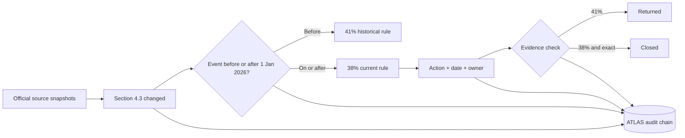

# TARA Evaluation Card

> **Plain-language verdict:** TARA demonstrates a complete and reproducible regulatory change-to-action loop on a deliberately narrow, synthetic case. It detects a source change, selects the rule version that applies on the event date, creates an action, rejects superseded evidence, accepts exact evidence, and preserves an auditable trace.

## Visual acceptance path



## Executable acceptance checks

| # | Check | Result | Reproducible evidence |
|---:|---|---|---|
| 1 | Source change detected | **PASS** | SURVEY reports Section 4.3 amended and preserves both source hashes. |
| 2 | Historical rate selected | **PASS** | A 2025 event selects the 41% rule and excludes the post-2026 rule. |
| 3 | Current rate selected | **PASS** | A 2026 event selects the 38% rule and excludes the superseded 41% rule. |
| 4 | Superseded evidence rejected | **PASS** | ANCHOR returns a 41% computation and closes the exact 38% computation. |
| 5 | False-positive action blocked | **PASS** | A foreign property no longer creates an FBAR action merely because the pack is in scope. |
| 6 | Missing threshold handled safely | **PASS** | A missing FBAR threshold fact yields no automated action. |
| 7 | Qualitative timing is not invented | **PASS** | A source that says 'within a reasonable period' remains manually scheduled; TARA emits no fabricated statutory date. |
| 8 | Audit chain verifies | **PASS** | ATLAS verifies a 21-entry hash chain after the acceptance run. |

**Test inventory:** `115 tests collected`. The canonical command is `pytest -q`.

## Competition readiness score

This is an **internal evidence-based readiness estimate, not an organiser or judge score**.

| Dimension | Weight | Current | Why |
|---|---:|---:|---|
| Problem clarity and relevance | 18 | 17 | Clear change-to-action problem with a memorable human consequence. |
| Innovation and agent design | 18 | 16 | Open/tenant bands, data-driven domain packs, MCP tools, and an auditable multi-agent handoff. |
| Technical architecture | 15 | 14 | Deterministic core, explicit band order, reusable packs, deployable API, and regression coverage. |
| Correctness and safety | 18 | 15 | Effective-date selection, obligation-level predicates, fail-closed missing facts, exact evidence checks, and disclaimers. Independent professional validation is still pending. |
| Evidence and demo quality | 12 | 11 | Tested golden path, offline replay, live deployment, source hashes, and this executable card. |
| Usability and storytelling | 9 | 8 | Recommended path first, plain-language explanations, visual guide, and exploratory cases clearly labelled. |
| Validation and traction | 6 | 2 | No external user interviews, signed design partner, or SME sign-off is claimed. |
| Release and documentation quality | 4 | 4 | Reproducible setup, public-release manifest, tests, deployment notes, and one-stop guide. |
| **Total** | **100** | **87** | **Finalist-grade internal readiness; external validation is the main remaining gap.** |

## Boundaries judges should know

TARA is a **prototype decision-support system**, not legal, tax, immigration, or filing advice. The live demo uses controlled source snapshots and synthetic profiles. A pack-level `CONFIRMED` result means the rule family is relevant; each obligation is then checked separately for its instrument, event, threshold, and effective date. Missing material facts produce `indeterminate` and no automated action.

The system does not yet claim continuous regulator polling, production authentication, durable multi-tenant storage, or independent legal validation. Those are explicitly release-gated rather than implied.

## Reproduce

```bash
pip install -e '.[dev]'
pytest -q
python tools/build_evaluation_card.py
python -m uvicorn demo.api:app --host 127.0.0.1 --port 8000
```

Generated 2026-09-13 from executable acceptance checks in `tools/build_evaluation_card.py`.
