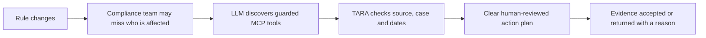

# TARA Judge-Facing Slide Deck Checklist

> **Goal:** make the customer, problem, working solution, AI value, and commercial path unmistakable within a **seven-minute pitch**, while leaving enough time for the required three-minute question period.

The official participant playbook groups judging under four areas: **Problem & Customer, Solution, Commercial Focus, and Build with AI**. It asks teams to show a clear target customer, credible problem evidence, a working and differentiated prototype, a believable business model, meaningful AI use, and responsible AI practice. This checklist maps the TARA story directly to those expectations.

## The story in one picture

The audience should understand this flow before they see agent names, architecture, or implementation detail.

## Recommended seven-slide sequence

| Slide | Time | What the slide must communicate | Evidence to show |
|---|---:|---|---|
| **1. The promise** | 0:30 | “TARA turns a regulatory change into a clear, reviewable action for the people it affects.” Name the first buyer and user. | One sentence each for target buyer, end user, and outcome. |
| **2. The customer problem** | 0:50 | Compliance teams must compare changing rules, identify affected people, create tasks, and collect proof. The current process is slow, fragmented, and easy to get wrong. | A sourced market/problem statistic, one interview quote or mentor insight, and the cost of delay or error. |
| **3. Before and after TARA** | 0:50 | Show the current manual workflow beside the TARA workflow. Make the reduction in handoffs and ambiguity visible. | A simple before/after diagram with expected time, steps, and review points. Label estimates honestly until measured. |
| **4. Working AI demo** | 1:30 | Run Maeve: OpenAI discovers TARA’s MCP tools, finds the source and case, then TARA selects 38%, creates four next steps, rejects 41%, accepts 38%, and records the reasoning. | Live demo link or QR code, readable MCP trace, plus deterministic and replay backup screenshots. |
| **5. Why AI, and why this design** | 1:00 | The LLM chooses and sequences guarded MCP tools; deterministic code owns dates, thresholds, rate selection, arithmetic, and evidence checks. Humans approve real action. | One-picture architecture, visible MCP trace, AI-versus-rules boundary, and “ask, do not guess” behaviour. |
| **6. Commercial path** | 1:00 | Identify the paying customer, initial use case, pricing hypothesis, route to market, and why the model scales across rule areas. | Buyer, user, pricing unit, first sales channel, expansion path, and one competitor/differentiation table. |
| **7. Proof, roadmap, and ask** | 0:50 | Separate what works today from what must be validated next. End with a specific request. | 115 passing tests, eight acceptance checks, live URL, source-backed failure/success demo, next pilot milestones, and the help or introduction requested. |

This plan uses **6 minutes 30 seconds**, leaving a 30-second buffer inside the seven-minute pitch.

## Non-negotiable content by judging area

| Official judging area | Deck checklist |
|---|---|
| **Problem & Customer** | Name one beachhead buyer and one day-to-day user. State the urgent job they cannot do reliably today. Include credible evidence that the problem is real and large enough to pursue. Avoid describing “everyone with compliance needs” as the customer. |
| **Solution** | State the unique value proposition before explaining features. Demonstrate the working prototype. Show one controlled failure and one success. Explain why TARA is more practical or trustworthy than a chatbot or manual spreadsheet. |
| **Commercial Focus** | Show who pays, what they pay for, the pricing hypothesis, route to market, likely sales cycle, and expansion path. Include competitors or alternatives. Distinguish early assumptions from validated traction. |
| **Build with AI** | Explain that the LLM dynamically discovers and sequences MCP tools, rather than filling a form or producing a prompt-only answer. Show where deterministic controls take over. Include human review, missing-information behaviour, evidence traceability, privacy boundaries, and responsible-use limits. |

## The 90-second live-demo checklist

Use the **Maeve** case only for the main pitch. The other cases are optional breadth examples for questions.

- [ ] Open the permanent demo before presenting and confirm it says **AI/MCP: on** and **AI / MCP READY**.
- [ ] Select **Maeve** and state the problem in one sentence: “Revenue changed this rate from 41% to 38%; a plausible old calculation can now be wrong.”
- [ ] Show the **AI orchestration · MCP** trace and say: “The model discovers the source and case through guarded tools; it does not invent them.”
- [ ] Show **What changed** and point to the simple **Before / Now** comparison.
- [ ] Open **What applies** and say: “The 2026 event selects the current 38% rule and creates four next steps.”
- [ ] Open the **Action plan** and point to the task, date, and evidence required.
- [ ] Open **Check evidence**, choose **Apply 41% instead of 38%**, and show **Needs correction**.
- [ ] Choose **Restore the correct example**, check it again, and show **Accepted**.
- [ ] Open **Proof record** and show that the source-to-action record is complete and its tamper check passed.
- [ ] Stop. Do not open the raw technical trace unless a judge asks.

## Language and visual checks

- [ ] Every acronym is expanded the first time it appears.
- [ ] Internal requirement IDs, field names, hashes, and agent names are absent from the main story.
- [ ] Each slide has one headline that states the conclusion, not merely the topic.
- [ ] Use diagrams, screenshots, or one chart instead of dense paragraphs.
- [ ] Body text is readable from the back of the room; avoid screenshots with tiny interface text.
- [ ] The same target customer, product claim, test count, and live URL appear throughout the deck.
- [ ] Use **working prototype**, **prepared synthetic case**, **controlled source snapshots**, and **LLM-first with deterministic controls** accurately.
- [ ] Do not claim legal validation, continuous monitoring, regulator approval, production security, or traction that has not occurred.

## Commercial evidence to add before presenting

The software evidence is strong, but the official criteria also reward market validation and commercial viability. Add as many of these as can be truthfully supported:

- [ ] A short quotation or quantified finding from a compliance professional, adviser, or mentor.
- [ ] A clearly defined first buyer, such as a cross-border tax advisory practice or regulated employer mobility team.
- [ ] A pricing hypothesis tied to a buyer unit, such as per adviser seat, monitored entity, or rule pack.
- [ ] A competitor/alternative comparison covering manual research, generic copilots, and enterprise regulatory platforms.
- [ ] A pilot proposal with duration, data boundary, success metric, and responsible human-review process.
- [ ] One measurable outcome to test, such as review time, missed-change rate, false-positive rate, or evidence rework.

## Three-minute question preparation

Have one concise answer and one evidence slide ready for each question below.

| Likely judge question | Answer must cover |
|---|---|
| **Why does this need AI?** | The model interprets the request, discovers the applicable source and case through MCP, chooses the guarded tool sequence, and explains the result. Deterministic controls own high-consequence calculations and decisions. |
| **Who pays for it?** | A specific initial buyer, their current cost, the pricing unit, and the first route to market. |
| **How is it different?** | It connects source changes to affected cases, actions, evidence checks, and an inspectable record rather than stopping at search or summarisation. |
| **How do you prevent harmful advice?** | Controlled sources, versioned rules, explicit missing-information states, deterministic checks, scope labels, qualified human approval, and a server-side key boundary. |
| **Can it scale?** | Reusable rule-pack structure, shared MCP tools, deterministic controls, and the review process required before adding a new regulated domain. |
| **What is real today?** | Live LLM/MCP prototype, prepared cases, a visible MCP trace, 115 tests, eight acceptance checks, deterministic and replay fallbacks, and public code. State external-validation gaps plainly. |

## Final submission and venue checks

- [ ] Submit an accessible deck link before the published deadline and test it in a logged-out browser.
- [ ] Confirm the deck remains editable through the submitted link if that is the intended workflow.
- [ ] Keep the total presentation at or below seven minutes and the combined pitch plus questions at or below ten minutes.
- [ ] Put the live demo URL and QR code on the demo slide: `https://tara-demo.onrender.com/`.
- [ ] Keep a screenshot of the MCP trace, two static result screenshots, the deterministic backup, and captured replay ready.
- [ ] Open the demo before the session so the hosted service is awake.
- [ ] Assign one speaker to drive the demo and one teammate to watch time and handle fallback.
- [ ] End with a concrete ask: pilot partner, domain reviewer, buyer introduction, or investment conversation.

## Source

This checklist is aligned to the **TechIreland National AI Challenge 2026 Participants Playbook**, especially the “Success Factors,” the seven-minute pitch plus three-minute Q&A format, and Appendix 2: Evaluation Criteria (Problem & Customer, Solution, Commercial Focus, and Build with AI). The playbook was supplied directly with the project materials on 13 September 2026. The public event listing independently confirms the challenge dates, final-slide deadline, in-person presentation day, and emphasis on AI agents and real-world problems.[1]

## References

[1]: https://connectedhubs.ie/events/event/techireland-national-ai-challenge-2026-372b3 "TechIreland National AI Challenge 2026"
