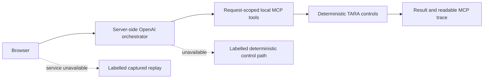

# Security, reliability, and observability

> This document describes a prototype deployment boundary. It is not a production certification.

## Security boundary

The public demo supports **synthetic prepared cases** only. It has no authentication, authorization, rate limiting, tenant identity, durable tenant storage, or production retention policy. Do not submit real personal, legal, tax, immigration, financial, or filing data.

The OpenAI API key is server-side only. It is not returned to the browser and is not passed to the request-scoped MCP subprocess. Each browser API request builds a fresh temporary register, graph version, and ATLAS ledger.

## Reliability model

The browser can use three clearly distinguished modes:



The default AI route is `/api/ai/run`. If the model call or local MCP subprocess fails, the browser switches to `/api/run`, which uses the same controlled sources, synthetic case data, and deterministic evidence rules. `demo/replay.js` is generated from deterministic API responses and supports only pristine prepared profiles.

## Observability and audit

The health endpoint reports service state, loaded pack count, agent names, and server time. It also reports whether server-side AI orchestration is configured without exposing credentials.

ATLAS records domain decisions in an append-only, hash-linked JSONL chain and exposes `verify_chain()`. It is a domain trace rather than a replacement for infrastructure logs, metrics, distributed traces, or a production audit platform.

## Known limits

| Limit | Current consequence | Production requirement |
|---|---|---|
| No identity or authorization | Any reachable caller can use the service. | Service identity and per-tool authorization. |
| No durable tenant storage | The prototype cannot be a system of record. | Transactional storage with backup and retention controls. |
| Controlled source snapshots | Source freshness is manual. | Governed retrieval, approval, freshness alerts, and rollback. |
| JSONL ledger | A crash can leave a partial final record. | Transactional storage and integrity monitoring. |
| Limited telemetry | Operational failures are harder to diagnose. | Structured logs, metrics, traces, dashboards, and alerts. |
| Third-party model availability | AI orchestration can time out or fail. | Provider failover, circuit breaking, and cost controls. |

## Local checks

```bash
pytest -q
node --check demo/app.js
curl -fsS http://127.0.0.1:8000/api/health
```
