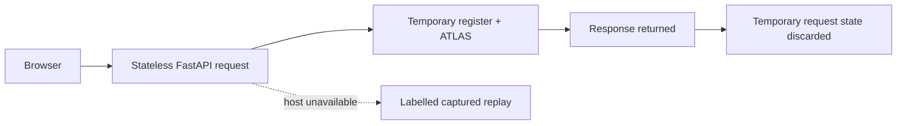

# Reliability, security, and observability

> This describes the current competition prototype, not a production certification.

## Plain-language view

The public demo is designed to be safe for **synthetic prepared cases**, easy to replay at a venue, and transparent about what it cannot guarantee. It is not designed to receive real personal or regulated data.



## Security

- The public demo has **no authentication**. Do not submit real personal, legal, tax, immigration, financial, or filing data.
- Each browser API request builds a fresh temporary register and ATLAS ledger. The demo does not intentionally persist submitted case data between requests.
- CORS is permissive because the optional static replay host may call the demo API cross-origin.
- The MCP server also has no production authentication, authorization, rate limiting, request-size policy, or tenant identity.
- Environment variables are used for secrets. Populated `.env` files are ignored and excluded from the public-release allowlist.
- The clean public-release builder scans for common private-key and token formats before creating a candidate.

## Reliability

- The Render service is deployed and serves the browser and FastAPI adapter from one origin.
- The free service can sleep. Open it before a live presentation.
- `demo/replay.js` is generated from real `/api/run` and `/api/verify` responses and provides a labelled fallback when the engine is unavailable.
- Replay works only for pristine prepared profiles. Edited profiles fail clearly when no engine is reachable.
- The main regression suite currently has 112 tests, including demo API acceptance checks.
- `tools/build_evaluation_card.py` executes eight public acceptance checks.
- GitHub Actions runs Python tests, JavaScript syntax validation, evaluation generation, and a public-release dry run.

## Observability and audit

- The demo health endpoint reports service state, pack count, loaded agents, and server time.
- ATLAS records domain decisions in an append-only, hash-linked JSONL chain and exposes `verify_chain()`.
- ATLAS is a **domain trace**, not a substitute for infrastructure logs, access logs, metrics, distributed traces, or a production audit platform.
- The service does not yet expose Prometheus metrics, OpenTelemetry traces, alerting, or structured per-request operational logs.

## Known operational limits

| Limit | Consequence | Production requirement |
|---|---|---|
| No identity or authorization | Anyone who can reach a service can call it. | OAuth/service identity and per-tool authorization. |
| No durable tenant storage | The public demo cannot act as a system of record. | Transactional tenant store with backup and retention policy. |
| No input-size caps or rate limits | Abuse can consume resources. | Gateway limits, quotas, and validation. |
| Snapshot sources | Source freshness is a manual process. | Governed retrieval, approval, freshness alerts, and rollback. |
| JSONL ledger | A crash during a write can leave a partial final line. | Transactional storage, recovery, and integrity monitoring. |
| No infrastructure telemetry | Operational failures are harder to diagnose. | Structured logs, metrics, traces, dashboards, and alerts. |

## Presentation preflight

```bash
curl -fsS https://tara-demo.onrender.com/api/health
pytest -q
python tools/build_evaluation_card.py
node --check demo/app.js
```

Keep replay, screenshots, and a short recording available. If a live result differs from the rehearsed golden path, switch to the fallback and investigate after the presentation.
